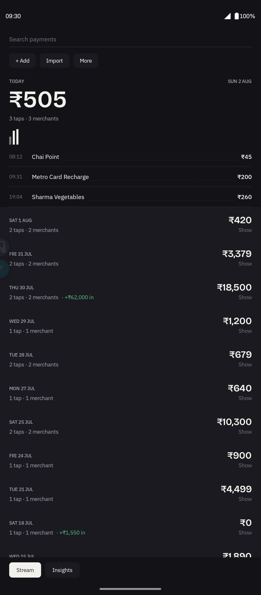
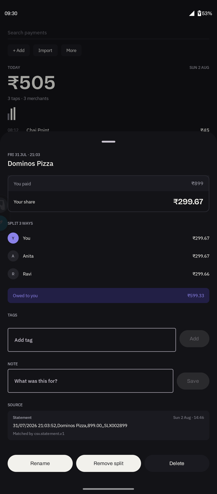
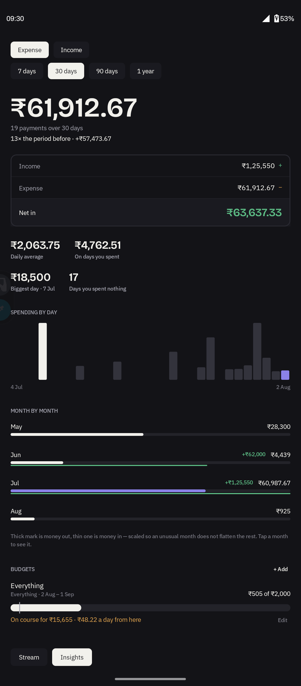
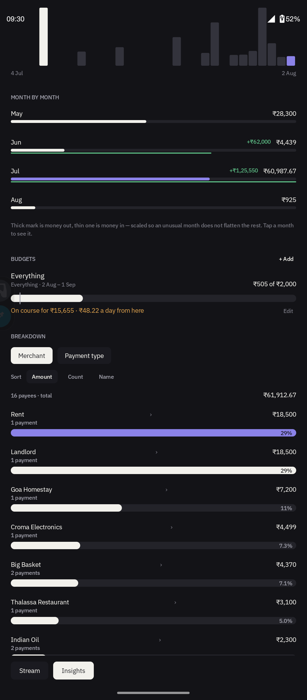
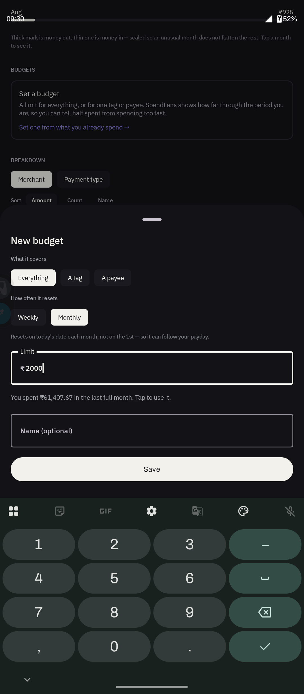
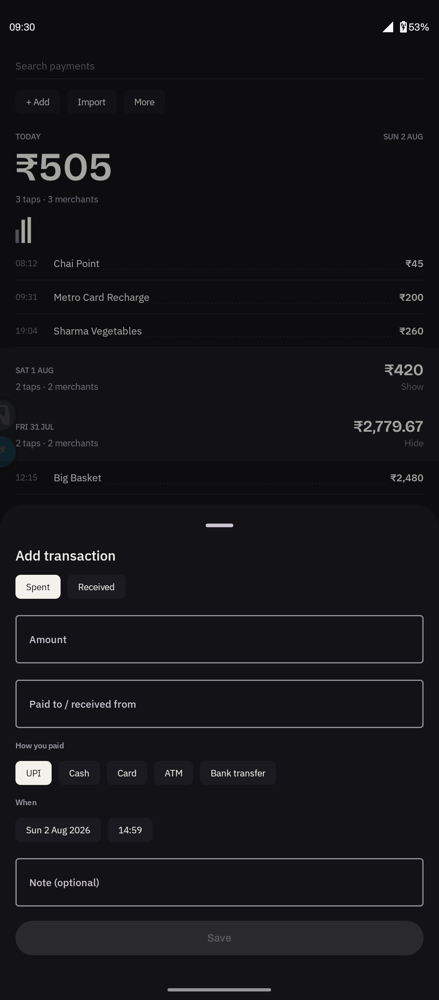
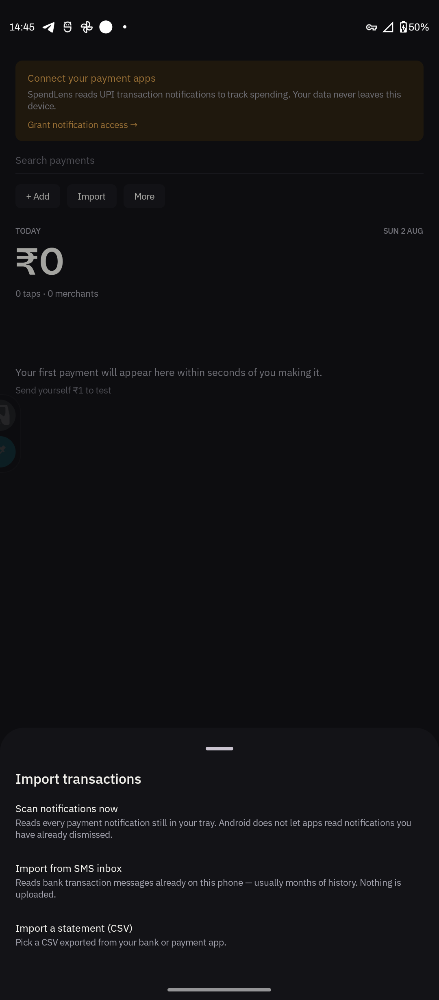
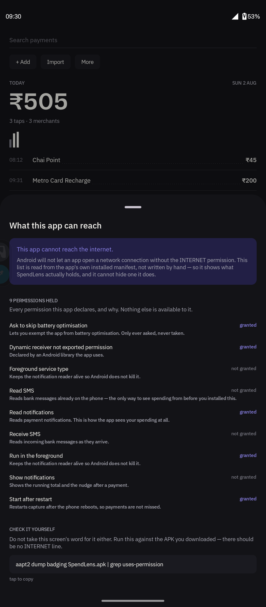

<div align="center">


# SpendLens

**The UPI tracker that can't leak your data — because it can't reach the internet.**

Reads the payment notifications and bank messages already on your phone, and
turns them into a record of your spending. Nothing is uploaded, because the app
holds no `INTERNET` permission at all.

[](LICENSE)
[](#build-from-source)
[](#privacy-you-can-check-yourself)
[](#build-from-source)

<br>

<a href="https://gitlab.com/p4r1ch4y-group/SpendLens/-/releases">
  
</a>
&nbsp;

&nbsp;


<sub>F-Droid submission is prepared and pending review. Only the <code>standard</code><br>build could ever go to Google Play — see <a href="#download">Download</a>.</sub>

</div>

---

<div align="center">

&nbsp;
&nbsp;
&nbsp;


<sub>The day stream · a split payment, and the message it was read from · insights · month by month, budgets, breakdown</sub>

</div>

---

## Why

Every expense tracker asks you to trust it with your bank data. SpendLens is
built so that trust is unnecessary: it has no network permission, so there is no
code path by which your ledger could leave the phone, whatever the app claims and
whatever it does in future.

It is organised as **days**, not as a dashboard. You recognise your own Tuesday;
you do not recognise a pie chart.

## What it does

| | |
|---|---|
| **Captures automatically** | Payment notifications from 19 UPI and bank apps, matched on the *shape* of the message rather than the app, so an unfamiliar wording still gets read |
| **Reaches backwards** | Reads bank SMS already in your inbox — usually months or years. This is the only way to recover spending from before you installed it |
| **Imports** | CSV statements from your bank, through the file picker; no storage permission needed |
| **Takes manual entries** | Cash and anything else it cannot see, with the date and time you choose |
| **Splits** | A payment, a whole day, or any selection — between named people, tracking who has paid you back |
| **Tags and trips** | A trip is a tag that knows its own dates, so the header can tell you how far through it you are |
| **Shows you the shape of it** | Spending by day, merchant, tag and rail, over 7, 30, 90 or 365 days — and twelve months side by side |
| **Keeps you to a limit** | Budgets for everything, one tag or one payee, each with a pace marker so "half spent" reads differently from "spending too fast" |
| **Opens every chart** | Tap any bar, column or month to see exactly the payments behind it |

<div align="center">

&nbsp;
&nbsp;


<sub>setting a budget, opened at what you already spend · manual entry · import</sub>

</div>

## Download

> **Alpha.** The capture pipeline and the ledger are real and tested, but there is
> **no backup format yet** — treat the data as disposable for now.

APKs are attached to each [release](https://gitlab.com/p4r1ch4y-group/SpendLens/-/releases).
There are two builds:

| Build | Reads | Permissions | For |
|---|---|---|---|
| **`standard`** | Payment notifications | No dangerous permissions | **Most people. Start here.** |
| **`full`** | Notifications **and** bank SMS | `READ_SMS`, `RECEIVE_SMS` | Recovering history from before you installed it |

Verify what you downloaded against the attached `SHA256SUMS.txt`.

**F-Droid** —  The build recipe, metadata and screenshots are
prepared in [`fdroid/`](fdroid/); what remains is the merge request to
[fdroiddata](https://gitlab.com/fdroid/fdroiddata) and its review. `standard`
goes first.

**Google Play** —  Only `standard` is a candidate. The `full`
build reads SMS, which Play's SMS and Call Log policy permits only for apps whose
core purpose is messaging, so it will stay an F-Droid and direct-download build.

<details>
<summary><strong>Google Play Protect will warn you — here's why, and what to do</strong></summary>

<br>

Play Protect blocks apps installed from a browser, messaging app or file manager
when they declare `NOTIFICATION_LISTENER` — which is the entire mechanism
SpendLens uses to see your payments. The warning reads *"This app can request
access to sensitive data."*

This is not something the app can engineer around; reading notifications **is**
the app. The `standard` build trips the same rule as `full`.

Installing over `adb install` avoids it. Otherwise you will have to allow the
install explicitly. [Google's own guidance on the
warning](https://developers.google.com/android/play-protect/warning-dev-guidance).

</details>

<details>
<summary><strong>Careful: don't switch between download sources</strong></summary>

<br>

The release APKs are signed with the project's key. An F-Droid build would be
signed with F-Droid's. Android will not let one replace the other as an update,
so moving between them means uninstalling first — **which erases your ledger**,
and there is no backup format yet. Pick one source and stay on it.

</details>

## Privacy you can check yourself

<div align="center">



<sub><b>The app audits itself.</b> This screen is not a hand-written list — it reads
the installed manifest back out of the package manager at runtime, using the same
API any auditor would, and shows every permission held with its grant state.
A screen that could lie about this would be worth nothing.</sub>

</div>

Not a policy — a property of the binary. Run this on the APK you downloaded:

```bash
aapt2 dump badging SpendLens-standard-release.apk | grep uses-permission
```

There is no `android.permission.INTERNET` line. There is no code that could use
one if there were.

- No account, no sign-up, no server
- No analytics, no crash reporting, no advertising SDK, no third-party services
- Ledger encrypted with SQLCipher (AES-256), the key sealed by the Android Keystore
- Notification and message contents are never written to logs
- `standard` ships six permissions in total, none of them dangerous

## Build from source

```bash
git clone https://gitlab.com/p4r1ch4y-group/SpendLens.git
cd SpendLens
./gradlew :app:assembleStandardDebug
```

Needs **JDK 21** (Android Studio's bundled JBR works) and **Android SDK 36**.
Fonts and icons are committed, so a clean clone builds with no extra steps.

```bash
./gradlew test lint      # 102 unit tests, plus lint on both flavours
```

Parsing, resolution, fusion and money live in `core/`, which has no Android
dependencies — the tests are plain JUnit and run in seconds without an emulator.

Full details, including why the release build is left unsigned and how to set up
your own signing key, are in **[BUILD.md](BUILD.md)**.

## How it works

```
core/
├── model/        Money, Vpa, Split, transactions — pure Kotlin
├── parser/       Notification and SMS templates, CSV statements
├── resolution/   The 6-rung merchant resolution ladder
├── fusion/       Merges the same payment seen on two rails
└── database/     SQLDelight schema over SQLCipher
app/              Jetpack Compose UI, services, repositories
```

Every rail converges on one path: **parse → dedupe → fuse → resolve → persist → nudge.**

<details>
<summary><strong>The five decisions everything else follows from</strong></summary>

<br>

**1. Money is an integer, always.** Every amount is a `Long` of paise, parsed
through `BigDecimal`. `2999.95 * 100` is `299994.999…` in binary floating point,
which truncates to ₹2999.94.

**2. The app never shows "Unknown".** A six-rung ladder — user rules, captured
name, VPA structure, merchant directory, fuzzy match, and an honest fallback —
always produces something a person recognises. Naming a merchant writes a *rule*
that is replayed over every past payment to the same VPA.

**3. Templates match message shapes, not apps.** Indian payment apps all
paraphrase the same NPCI sentences. Keying on the app meant a wording the author
had not personally seen produced silence. Measured against a real 4,103-message
inbox: **603 of 652** candidate messages captured.

**4. A phantom transaction is worse than a missing one.** Banks describe money
that has *not* moved in the same grammar as money that has — *"INR 605 will be
debited"*, *"payment has failed"*, *"total amount payable"*. These are vetoed
explicitly, and roughly half the SMS test suite asserts that nothing is produced.

**5. A split payment counts only your share.** Everywhere. Reporting the gross
would tell someone who fronted a group dinner that they spent ₹8,000 on food.
Shares always sum to exactly the total — ₹1,000 three ways is 333.34 / 333.33 /
333.33, never three lots of 333.33 with a paisa quietly lost.

</details>

<details>
<summary><strong>The tap bar</strong></summary>

<br>

The signature mark, and the app icon. One bar per payment, with square-root
height scaling so a ₹20 chai stays visible next to a ₹2,400 grocery run:

```kotlin
height = min + (max - min) * sqrt(amount / dayMax)
```

On a linear scale a single rent payment flattens a month of small ones into
invisible stubs — and the shape of the month is the entire point.

</details>

## Status

Alpha, and honest about it. Working: capture on all rails, the encrypted ledger,
splits, tags, trips, insights, and manual entry — verified on a physical device,
not only in tests.

Not built yet: encrypted backup and restore, budgets and categories, editing a
transaction from the UI, and PDF statement import. See
**[CHANGELOG.md](CHANGELOG.md)** for what shipped and `STATUS.md` for the
detailed picture.

## Contributing

Patches welcome — parser templates for banks that are not yet read are the most
useful thing you can send. **[CONTRIBUTING.md](CONTRIBUTING.md)** covers the
three rules that will get a change rejected, and how to test a template against
your own SMS backup without ever sharing it.

Please never paste a real bank message into an issue: it identifies your bank,
your account and often the person you paid. Anonymise the numbers and keep the
wording.

## Licence

[GPL-3.0](LICENSE). Copyleft, so the privacy claims stay checkable in every fork.
Bundled fonts are SIL OFL 1.1 — see [LICENSES/FONTS.txt](LICENSES/FONTS.txt).

## Contact

Subrata — [iamcsubrata@gmail.com](mailto:iamcsubrata@gmail.com) · [p4r1ch4y.github.io](https://p4r1ch4y.github.io/)

<div align="center">
<sub>Make the invisible flow visible, in the moment it happens,<br>and keep every byte of it on the user's device.</sub>
</div>
